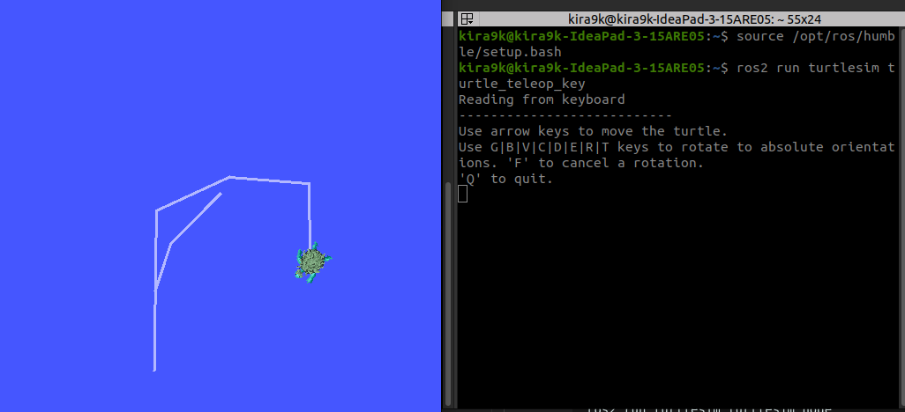
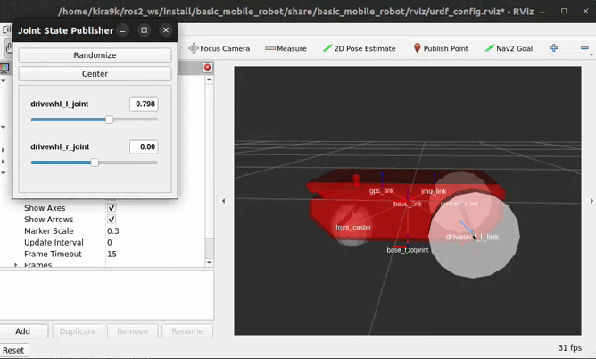

# Семинар 1

<strong>ROS2 (Robot Operating System 2)</strong> — это фреймворк с открытым исходным кодом для создания робототехнических приложений, обеспечивающий стандартизированную среду для разработки, тестирования, запуска и масштабирования программ, связанных с управлением роботами. ROS2 является дальнейшим развитием ROS и предоставляет улучшенную архитектуру, а также повышенную надёжность и безопасность.


В ROS2 основной механизм обмена информацией между нодами — это топики (`topics`). Топики представляют собой канал связи между нодами. Каждая нода (выполняемая программа) может выступать в роли паблишера (`publisher`), публикующего сообщения в топик, или подписчика (`subscriber`), который эти сообщения принимает и обрабатывает. Сообщение является определенной структурой данных.

## Ros2 graph
Граф ROS представляет собой сеть элементов ROS 2, обрабатывающих данные вместе в одно и то же время. Он охватывает все исполняемые файлы и связи между.

## Nodes в ROS2
Каждый узел в ROS должен отвечать за одну модульную задачу, например, управление двигателями колес или публикацию данных датчиков лазерного дальномера. Каждый узел может отправлять и получать данные от других узлов через темы, службы, действия или параметры.


## Topics в ROS2

ROS 2 разбивает сложные системы на множество модульных узлов. Темы являются жизненно важным элементом графа ROS, который действует как шина для обмена сообщениями между узлами.


Узел может публиковать данные в любом количестве тем и одновременно иметь подписки на любое количество тем.


Темы являются одним из основных способов перемещения данных между узлами и, следовательно, между различными частями системы.

## Services в ROS2
Сервисы — это еще один метод коммуникации для узлов в графе ROS. Сервисы основаны на модели «вызов-ответ» в отличие от модели «издатель-подписчик» тем.


Темы являются одним из основных способов перемещения данных между узлами и, следовательно, между различными частями системы. В то время как темы позволяют узлам подписываться на потоки данных и получать постоянные обновления, службы предоставляют данные только тогда, когда они специально вызваны клиентом.


## Parameters в ROS2

Параметр — это значение конфигурации узла(настройки узла). Узел может хранить параметры как целые числа, числа с плавающей точкой, логические значения, строки и списки.В ROS 2 каждый узел поддерживает свои собственные параметры.

## Actions в ROS2


## Задание 1. Знакомство с консольными командами ROS 2.

Команда `ros2 run demo_nodes_cpp talker` запускает ноду-издатель, а команда `ros2 run demo_nodes_py listener` запускает ноду-подписчик. На рисунке ниже показан вывод в консоли при выполнении этих двух команд 


Команда `ros2 node list` показывает список активных узлов.


Команда `ros2 topic list` выводит список всех активных топиков в системе.


Команда `ros2 topic echo /chatter` - подписывается на топик `/chatter` и выводит все сообщения, которые в него публикуются.


Команда `ros2 node info /listener` - выводит информацию об узле `/listener`, включая подписки, публикации и доступные сервисы.


Команда `ros2 topic info /chatter` - выводит информацию о топике `/chatter`, включая тип сообщения, количество издателей/подписчиков.


Команда `ros2 topic hz /chatter` вычисляет частоту в герцах, с которой сообщения публикуются в указанный топик (`/chatter`)


Узлы `talker` и `listener` - это отдельные процессы, которые должны работать одновременно. Запуск в разных терминалах позволяет им выполняться параллельно, обеспечивает читаемый вывод и упрощает управления. Команды анализа используются для мониторинга системы. Их запуск в отдельном терминале позволяет собирать информацию о топиках и узлах, не прерывая работу `talker` и `listener`.

## Задание 2. Turtlesim (робот черепаха 2d)

Запуск черепашки:
```
ros2 run turtlesim turtlesim_node
```
Управление черепашкой (открыто в другом терминале):

```
ros2 run turtlesim turtle_teleop_key
```
Изучение средств разработчика RQt. Запустил в еще одном терминале:

```
rqt
```
<p align="justify">
На рисунке ниже показно окно с черепашкой и консоль с указанными клавишами для управления
</p>



На рисунке ниже показано окно rqt.


Управление происходит за счет узла `/teleop_turtle`. Он преобразует нажатия клавиш (стрелки) в сообщения типа `geometry_msgs/msg/Twist`, содержащие линейную скорость и угловую скорость. Эти сообщения отправляются в топик `/turtle1/cmd_vel`, который принимает узел `/turtlesim`.

Список узлов: 

* `/teleop_turtle`, 
* `/turtlesim`.

Список топиков: 

* `/parameter_events`, 
* `/rosout`, 
* `/turtle1/cmd_vel`, 
* `/turtle1/color_sensor`, 
* `/turtle1/pose`.

## Задание 3. Универсальный формат описания роботов (URDF). Робот R2D2.

Запуск демонстрационного приложения 
```
ros2 launch urdf_tutorial demo.launch.py
```
Запуск rviz
```
rviz2 -d ~/ros2_seminars_ws/install/urdf_tutorial/share/urdf_tutorial/r2d2.rviz
```
Изменен закон движения на знак бесконечности, в файл модели urdf добавлены 2 колеса

Код представлен ниже 

```python
denom = 1 + cos(angle)**2
x = a * sin(angle) / denom
y = a * sin(angle) * cos(angle) / de

next_angle = angle + degree / 4
next_denom = 1 + cos(next_angle)**2
next_x = a * sin(next_angle) / next_denom
next_y = a * sin(next_angle) * cos(next_angle) / next_denom
yaw = atan2(next_y - y, next_x - x)  
odom_trans.header.stamp = now.to_msg()
odom_trans.transform.translation.x = x
odom_trans.transform.translation.y = y
odom_trans.transform.translation.z = 0.7
odom_trans.transform.rotation = euler_to_quaternion(0, 0, yaw)
```

Измененная часть urdf показана ниже
```xml
  <link name="wheel">
    <inertial>
      <mass value="0.5"/>
      <inertia ixx="1e-3" ixy="0" ixz="0" iyy="1e-3" iyz="0" izz="1e-3" />
      <origin/>
    </inertial>
    <visual>
      <geometry>
        <cylinder radius="0.1" length="0.05" />
      </geometry>
      <material name="black">
        <color rgba="0 0 0 1" />
      </material>
    </visual>
    <collision>
      <origin/>
      <geometry>
        <cylinder radius="0.1" length="0.05" />
      </geometry>
      <contact_coefficients mu="0" kp="1000.0" kd="1.0"/>
    </collision>
  </link>

 
  <joint name="wheelconnect" type="continuous">
    <origin xyz="0 0.07 -0.7" rpy="1.57 0 0" /> 
    <axis xyz="1 0 0" /> 
    <parent link="leg1"/>
    <child link="wheel"/>
  </joint>


  <link name="wheel2">
    <inertial>
      <mass value="0.5"/>
      <inertia ixx="1e-3" ixy="0" ixz="0" iyy="1e-3" iyz="0" izz="1e-3" />
      <origin/>
    </inertial>
    <visual>
      <geometry>
        <cylinder radius="0.1" length="0.05" />
      </geometry>
      <material name="black">
        <color rgba="0 0 0 1" />
      </material>
    </visual>
    <collision>
      <origin/>
      <geometry>
        <cylinder radius="0.1" length="0.05" />
      </geometry>
      <contact_coefficients mu="0" kp="1000.0" kd="1.0"/>
    </collision>
  </link>

 
  <joint name="wheelconnect2" type="continuous">
    <origin xyz="0 -0.07 -0.7" rpy="1.57 0 0" /> 
    <axis xyz="1 0 0" /> 
    <parent link="leg2"/>
    <child link="wheel2"/>
  </joint>
```
Движение показано ниже 


Содержание URDF файла робота R2D2

Все тела содержат три составляющие: 
* Инерционные свойства: масса и тензор инерции 
* Визуальные свойства: геометрия объекта, положение, материал
* Коллизионные свойства: геометрия объекта, коэффициенты контакта
1. Тела робота и их свойства 
    1. `axis` (ось) - центральная ось робота      
    2. `leg1` (нога) - правая нога робота
    3. `leg2` (нога) - левая нога робота
    4. `body` (корпус) - Основное тело 
    5. `head` (голова) - сферическая голова робота.
    6. `rod` (шток) - шток, выдвигающийся из головы.
    7. `box` (коробка) - небольшая коробка на конце штока.
    8. `wheel` (колесо) - добавленный link
    9. `wheel2` (колесо) - добавленный link
2. Суставы между телами
    1. `leg1connecnt` (соединение ноги 1)
        * Тип: `fixed`    
        * Родитель: `axis`         
        * Ребенок: `leg1`
        * Причина выбора: Нога жестко прикреплена к оси, не предполагается никакого движения отсносительно её
    2. `leg2connect` (соединение ноги 2)
        * Тип: `fixed`
        * Родитель: `axis`
        * Ребенок: `leg2`
        * Причина выбора: аналогично первой ноге=и
    3. `tilt` (наклон)
        * Тип: `revolute` (вращающийся)
        * Родитель: `axis`
        * Ребенок: `body`
        * Ось: (0,1,0) (вращение вокруг Y)
        * Пределы: От -0.5 до 0 рад
        * Усилие/скорость: 10 Н·м, 10 рад/с
        * Причина выбора: Корпус может наклоняться отсносительно оси, что имитирует движение R2D2 (например, наклон вперед/назад)
    4. `swivel` (поворот)
        * Тип: `continuous` (непрерывное вращение)
        * Родитель: `body`
        * Ребенок: `head`
        * Ось: (0,0,1) (вращение вокруг Z)
        * Причина выбора: Голова может вращаться вокруг вертикальной оси без ограничений, как у R2D2
    5. `periscope` (перископ)
        * Тип: `prismatic` (линейное перемещение)
        * Родитель: `head`
        * Ребенок: `rod`
        * Ось: (0,0,1) (движение по Z)
        * Пределы: От -0.5 до 0 м
        * Усилие/скорость: 10 Н, 10 м/с
        * Причина выбора: Штое перископа выдвигается и задвигается вертикально
    6. `boxconnect` (соединение коробки)
        * Тип: `fixed`
        * Родитель: `rod`
        * Ребенок: `box`
        * Причина выбора: Коробка жестко прикреплена к конце штока перископа
    7. `wheelconnect` (соединение колеса) (новый)
        * Тип: `continuous` (непрерывное вращение)
        * Родитель: `leg1`
        * Ребенок: `wheel`
        * Ось вращения: (0,1,0)
        * Причина выбора: Данный тип позволяет колесу вращаться свободно 
    8. `wheelconnect2` (соединение колеса) (новый)
        * Тип: `continuous` (непрерывное вращение)
        * Родитель: `leg2`
        * Ребенок: `wheel2`
        * Ось вращения: (0,1,0)
        * Причина выбора: аналогично `wheelcconnect1`
# Семинар 2
## Теория
### Xacro
`xacro` расширяет возможности xml и упрощает составление URDF моделей, увеличивает читаемость и редактируемость моделей.

#### Параметры
```xml
<xacro:property name="the_radius" value="2.1" />
<xacro:property name="the_length" value="4.5" />
<geometry type="cylinder" radius="${the_radius}" length="${the_length}" />
```
#### Математические выражения
```xml
<xacro:property name="radius" value="4.3" />
<circle diameter="${2 * radius}" />
```
#### Макросы
```xml
<xacro:macro name="circle_x2" params="radius">
	<circle diameter="${2 * radius}" />
</xacro:macro>

<xacro:circle_x2 radius="12" />
```
### Gazebo в URDF:
Формат URDF при использовыании в Gazebo, поддерживает дополнительные возможности, описываемые внутри элементов `<gazebo>`. Основыными такими возможностями является поддержка различных сенсоров (камер, лидаров, дальномеров и т.д.), контроллеров для реализации той или иной модели управления и возможности по описанию свойств тел (материала, коэфф. трения и т.д.).


Например, вот так выглядит описание diff_drive_controller, это контроллер позволяющий управлять моделью робота с дифференциальным приводом шасси (см. рис. выше) Обычно это два симметрично расположенных на неподвижных осях колеса, которые управляются независимо.
```xml
<gazebo>
    <plugin filename="libgazebo_ros_diff_drive.so" name="differential_drive_controller">

      <ros>
        <namespace>/</namespace>
      </ros>

      <!-- wheels -->
      <left_joint>drivewhl_l_joint</left_joint>
      <right_joint>drivewhl_r_joint</right_joint>

      <!-- kinematics -->
      <wheel_separation>${base_width+wheel_ygap}</wheel_separation>
      <wheel_diameter>${wheel_radius*2}</wheel_diameter>

      <!-- limits -->
      <max_wheel_torque>20.0</max_wheel_torque>
      <max_wheel_acceleration>1.0</max_wheel_acceleration>

      <!-- output -->
      <publish_odom>true</publish_odom>
      <publish_odom_tf>true</publish_odom_tf>

      <odometry_frame>odom</odometry_frame>
      <robot_base_frame>base_footprint</robot_base_frame>
    </plugin>
  </gazebo>
```
## Задание 1. Запуск симуляции робота TurtleBot3 в Gazebo (URDF для ROS2 и SDF для Gazebo)
Добавить дополнительный путь поиска моделей роботов для симулятора Gazebo:
```bash
export GAZEBO_MODEL_PATH=$GAZEBO_MODEL_PATH:/opt/ros/humble/share/turtlebot3_gazebo/models/
```
Определить тип робота (доступны `burger`, `waffle`, `waffle_pi`):
```bash
export TURTLEBOT3_MODEL=burger
```
Запустить симуляцию с картой:
```bash
ros2 launch turtlebot3_gazebo turtlebot3_world.launch.py
```
Осуществить управление роботом, для этого в другом терминале запустить:
```bash
export TURTLEBOT3_MODEL=burger
ros2 run turtlebot3_teleop teleop_keyboard
```
Открыть rviz2, чтобы увидеть то, что "видит" робот своими датчиками.
```bash
rviz2 -d /opt/ros/humble/share/turtlebot3_gazebo/rviz/tb3_gazebo.rviz
```

## Задание №2. Запуск симуляции робота описанного URDF+XACRO (без SDF)
Запуск симуляции робота в rviz
```bash
ros2 launch basic_mobile_robot basic_mobile_bot_v1.launch.py
```


Запустить симуляцию
```bash
ros2 launch basic_mobile_robot basic_mobile_bot.launch.py
```
Управление роботом
```bash
ros2 run teleop_twist_keyboard teleop_twist_keyboard
```


# Семинар 3. Управление роботом YouBot (beta version)
## Задание 1. Управление 3d моделью робота в RVIZ через joint states
Запустил демонстрацию управления роботом, с помощью Joint State Publisher Gui
```
ros2 launch youbot_description rviz.launch.py
```


Запуск визуализации "танца" робота путем передачи в робот Joint States
```
python3 src/youbot_description/scripts/state_publisher.py 
```


## Задание 2. Программируем траекторию
Ниже представлен код для `path`
```python
path = [
    { 
        "t": 2,
        "arm": [0, 0, 0, 0, 0]
    },
    {  
        "t": 1.5,
        "arm": [0, 60, -120, 60, 0]
    },
    {  
        "t": 1.5,
        "arm": [-45, 45, -90, 45, 30]
    },
    { 
        "t": 1.5,
        "arm": [45, 45, -90, 45, -30]
    },
    {  
        "t": 1,
        "arm": [0, 30, -60, 30, 0]
    },
    {
        "t": 1,
        "arm": [0, 60, -30, 60, 0]
    },
    {
        "t": 1,
        "arm": [0, 30, -60, 30, 0]
    },
    {  
        "t": 2,
        "arm": [30, 45, -90, 45, 0]
    },
    {
        "t": 2,
        "arm": [-30, 45, -90, 45, 0]
    },
    {  
        "t": 1,
        "arm": [0, 60, -120, 60, 0]
    },
    {
        "t": 1,
        "arm": [0, 30, -60, 30, 0]
    },
    {
        "t": 1,
        "arm": [0, 60, -120, 60, 0]
    },
    {
        "t": 1,
        "arm": [0, 30, -60, 30, 0]
    },
    {  
        "t": 2,
        "arm": [90, 45, -90, 45, 0]
    },
    {
        "t": 2,
        "arm": [-90, 45, -90, 45, 0]
    },
    { 
        "t": 3,
        "arm": [0, 0, 0, 0, 0]
    }
]
```
